# Game Asset Studio · 架构与技术深潜

> 对话式游戏宣发素材生成系统。在一个对话窗口里完成 **换角色 / 换背景 / 换文案 → 切平台尺寸 → 图层精修 → 生视频 → 下载打包** 的闭环。后端 Go 单二进制，前端 React 编译产物 `embed` 进二进制，开箱即跑。
>
> 本文是面向工程团队的架构技术文档：系统全貌、核心数据流、各子系统深潜、关键工程卡点与决策复盘、垂类护城河。所有结论对齐代码实现（标注 `file:line`），而非规划文档的应然描述。

---

## 目录

1. [系统定位与垂类护城河](#1-系统定位与垂类护城河)
2. [整体架构](#2-整体架构)
3. [一次对话的端到端数据流](#3-一次对话的端到端数据流)
4. [子系统深潜](#4-子系统深潜)
   - 4.1 [Agent 编排（护城河核心）](#41-agent-编排护城河核心)
   - 4.2 [生图与质量门控](#42-生图与质量门控)
   - 4.3 [平台适配](#43-平台适配)
   - 4.4 [视觉分析与图层精修](#44-视觉分析与图层精修)
   - 4.5 [实时传输层](#45-实时传输层)
   - 4.6 [会话、存储与配置](#46-会话存储与配置)
   - 4.7 [生视频](#47-生视频)
   - 4.8 [前端](#48-前端)
5. [关键工程卡点与决策复盘](#5-关键工程卡点与决策复盘)
6. [优雅降级矩阵](#6-优雅降级矩阵)
7. [技术栈与约束](#7-技术栈与约束)

---

## 1. 系统定位与垂类护城河

### 1.1 它解决什么

游戏发行/买量团队的高频痛点：同一套 key art 要反复"换角色 / 换背景 / 换文案 → 切成各广告位尺寸 → 出 N 个变体测 CTR → 配动效 → 打包投放"。传统做法是设计师在 PS 里手工搬运，慢且不可规模化。本系统把这些操作收敛到**一个对话窗口**，由 Agent 识别意图并分发到确定性工具链。

### 1.2 护城河不在"会调生图 API"，而在垂类约束的工程化

通用生图工具谁都能接。本系统的壁垒是把**游戏宣发垂类的硬约束**做成了不可绕过的工程机制：

| 垂类硬约束 | 工程化落点 | 代码锚点 |
|---|---|---|
| **主体身份/构图保真**是宣发第一标准 | 融合/适配请求级锁定 `gpt-image-2`，HTTP 层不发 `input_fidelity`（该模型自动高保真且拒收该参数） | `agent.go:642-655`、`http_provider.go:134-136` |
| **颜色不能漂移**成"通用插画" | 源图主色板提取后注入生图 prompt，质检维度回查和谐度 | `palette.go:21-93`、`prompt.go:429-438` |
| **平台尺寸**是离散强约束，错一档广告位就废 | 数据驱动平台尺寸目录 + 比例感知路由（匹配比例走确定性裁切，不匹配才 AI 重绘） | `crop/service.go`、`adapt.go:48-166` |
| **形变/留白/砍头**都是美感杀手 | 保比例预放大（禁止非均匀拉伸）+ 极端比例 safe-band 提示 + 主体感知裁切锚点 | `service.go:856-866`、`prompt.go:531-589` |
| **图层精修要"接得回去"** | 确定性掩码抠图：主体 RGB 逐字节来自原图、背景=原图本身，全程零生图模型 | `layering/crop.go:26-101` |
| **弱会话模型会"假装执行"/漏步骤** | fake-ack 检测+自纠重试、submit_plan 服务端串行编排、工具去重 | `fakeack.go`、`plan.go`、`tools.go:124-187` |
| **质量不可控** | 多维 AI 判官 + 硬红线 + bestOf 重试，红线优先于总分 | `quality.go:416-466` |

这些约束的共同特征：**单靠 prompt 工程做不到，必须靠确定性代码兜底**。这是垂类工具相对通用 ChatGPT 套壳的真正差异。

---

## 2. 整体架构

### 2.1 模块全景

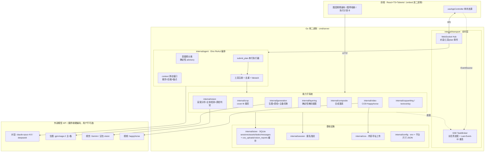

### 2.2 注入式闭包：打破依赖环 + 能力可选

`cmd/server/main.go` 是装配层。各能力子系统暴露 `SetXxx(fn)` 注入点，main 用**闭包**按"凭证是否配置成功"决定是否注入。这一个模式同时解决两个问题：

- **打破包依赖环**：`workspace` 不 import `crop`/`vision`/`cos`/`generation`，靠 main 闭包桥接（`workspace.go:45-70` 字段注释明确 "injected so workspace doesn't import X"）。
- **能力优雅降级**：未配置则保持 nil，对应端点返回 503 / 工具移出白名单 / Agent 礼貌告知，**从不崩溃**。

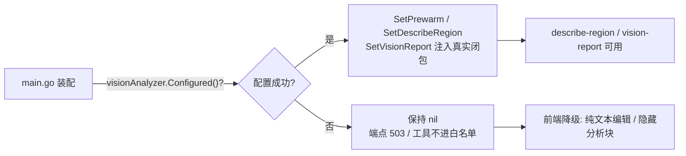

关键判定：`main.go:388-393` 若 `visionAnalyzer.Configured()==false` 则置 `visionAnalyzer=nil`，后续所有 `if visionAnalyzer != nil` 守卫的注入块全部跳过。同模式遍布质量门、像素预筛、主体检测、outpainter、抠图 provider、text-to-image、video。

---

## 3. 一次对话的端到端数据流

以"把图2的角色融合进图1，做成 iOS 4 个尺寸"这类复合指令为例，展示从用户消息到产物回填的完整链路：

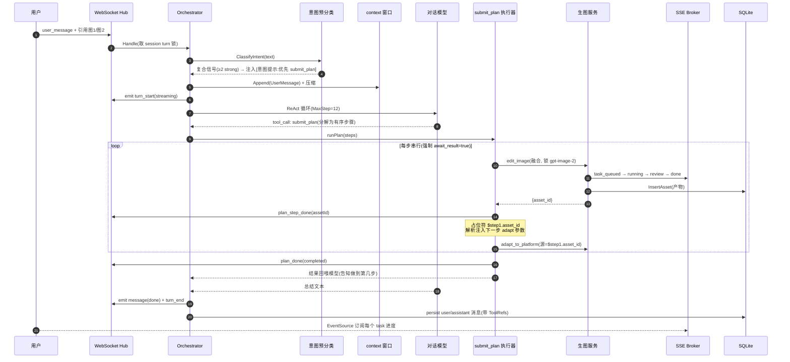

要点：
- **异步工具走 `ToolReturnDirectly`**（`AsyncTaskTools()`），结果直达用户不回喂模型——否则小模型会把 `{status:queued}` 读成"没做完"反复重调。
- **复合指令交给 `submit_plan` 服务端确定性串行**，而非依赖模型自觉 `await_result` + 读 `asset_id` + 正确串联（弱模型在此高频翻车：漏步、空产物、并行导致用了旧底图）。
- **产物回填**：异步工具仅返回 `task_id`，前端据此插占位卡并订阅 SSE；任务真正完成时由生图服务回调 `SetLastProduced` 更新 sticky-last-output，使下一轮默认编辑最新产物。

---

## 4. 子系统深潜

### 4.1 Agent 编排（护城河核心）

代码在 `internal/agent/`，是建立在 CloudWeGo Eino ReAct agent 之上的薄封装（Eino 类型不外泄到 app 其它部分，`agent.go:1-6`）。

#### 工具清单

| 工具 | 职责 | 特性 |
|---|---|---|
| `edit_image` | 换背景/换角色/加角色/换文案 | 异步·ReturnDirectly·支持 `await_result` |
| `adapt_to_platform` | 平台尺寸适配（AI 理解后重绘补全，非纯裁剪） | 异步·vision 预分析确认门控·`await_result` |
| `generate_image_from_text` | 纯文生图 | 异步·ReturnDirectly |
| `generate_variants` | 一次产出多个 creative 变体（A/B 测 CTR） | 异步批量·ReturnDirectly |
| `extract_layer` | 抠图产出透明底图层 | 异步·ReturnDirectly |
| `image_to_video` | 一图+动作描述生成短视频 | 异步·仅 video 配置时注册 |
| `search_images` | 搜图下载到工作区 | 异步·standalone 返回空/await 返回 JSON |
| `crop_to_sizes` | 纯图像裁剪到平台尺寸（不过 AI） | 同步·回喂模型 |
| `list_platform_sizes` | 列可用尺寸预设 | 同步·回喂模型 |
| `generate_copy` | 结构化投放文案（基于素材 vision 报告，不虚构卖点） | 同步·渲染文案卡 |
| `overlay_text` | 确定性服务端字体渲染叠加 CTA/角标/大字 | 同步·ReturnDirectly |
| `clarify_intent` | 缺关键参数时发结构化反问 | ReturnDirectly·结束本轮 |
| `submit_plan` | 多步依赖编排，串行执行可链式工具 | 回喂模型 |
| `web_search` | 模型自助联网查证 | 同步·回喂模型 |

#### 意图预分类：确定性只产 advisory，不路由

`intent.go` 的确定性分类**从不自己路由工具，只产出软信号**：

- 白名单关键词表 `intentRules`（`intent.go:48-83`）：每意图分 `strong`（特异词，单独命中即 1.0）与 `weak`（泛词如"尺寸""视频"，仅 0.5）。
- 阈值 `hintThreshold=0.6`：只有 strong 命中才注入 `[意图提示]`，weak-only 不注入避免误导。system prompt 明确告诉模型这是服务端猜测、是数据非指令、可忽略。
- 复合识别 `looksCompound`（`intent.go:166-187`）：≥2 个 strong，或 1 个产出/编辑动作 + 连接词（然后/再/并）/多尺寸信号 → 建议 `submit_plan`。保守设计：单纯"切成各平台尺寸"（一个 adapt）不会误判为复合。

#### context 滑动窗口

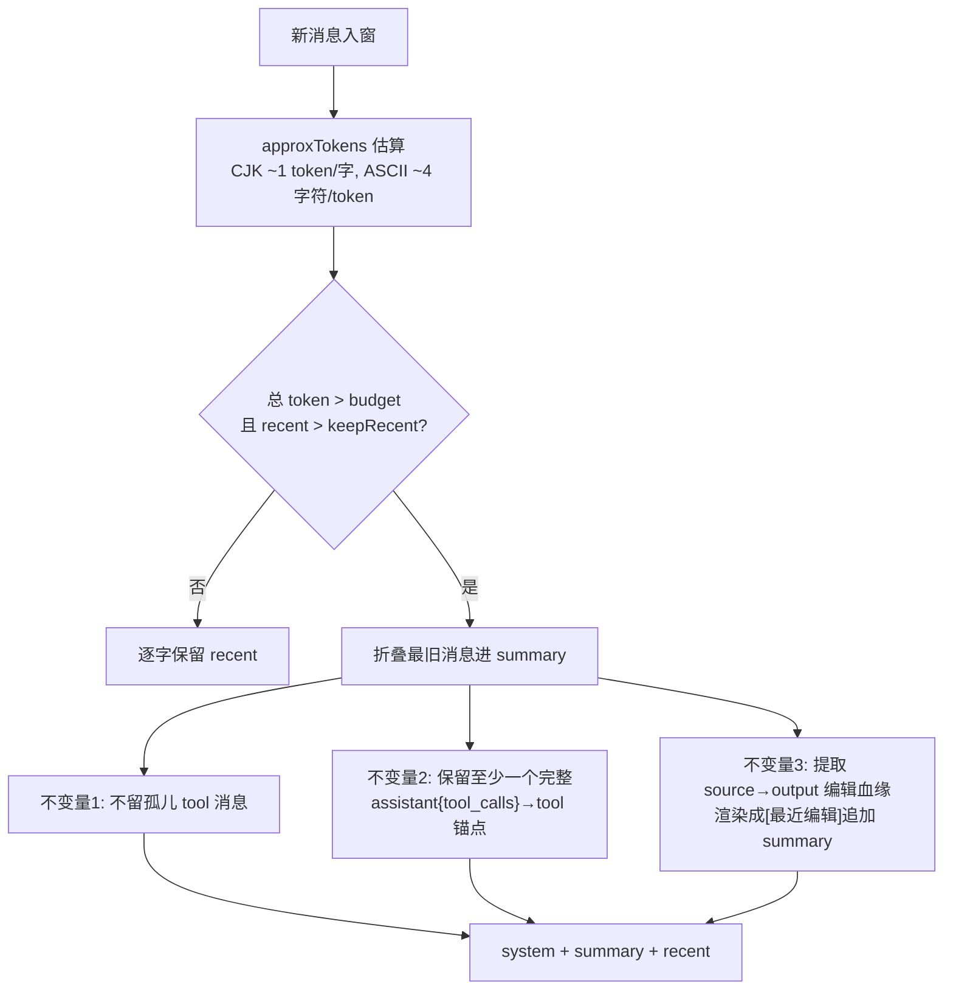

三条不变量都是为修真实 bug：
- **不变量2（tool-primed 锚点）**：若压缩抹掉所有 tool 交换，会"反向训练"模型不再调工具（reverse-few-shot bug）。连模型自我介绍都故意不入窗，免得稀释"调工具"信号（`agent.go:278-289`）。
- **不变量3（edit lineage 锚点）**：防压缩抹掉"在迭代哪张图"，按字段 merge（source 和 output 常分属不同压缩批次，`window.go:355-374`）。
- 大二进制结果**绝不入窗**，用 `AppendToolRef` 存引用 id。

#### submit_plan 串行执行器

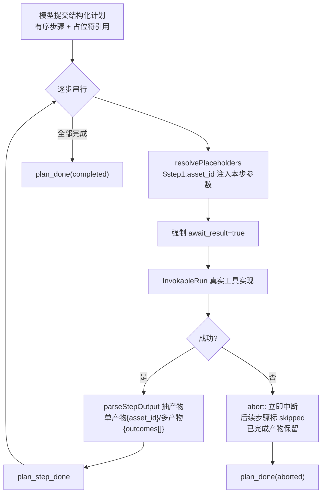

- 占位符 `resolvePlaceholders`（`plan.go:134-177`）：正则 `^\$([A-Za-z0-9_-]+)\.(asset_id|asset_ids)$`，只支持整值引用，递归遍历 args。引用未完成步骤/空产物 → 该步失败而非用坏输入跑。
- 可链式工具白名单 `plannableTools`：只含产出工作区资产、可被后续消费的工具；`clarify_intent`/`list_platform_sizes`/`generate_copy`/`submit_plan` 自身被排除。
- 步数上限 `maxPlanSteps=6`。结果**回喂模型**让其如实告知做到第几步、第几步因何失败。

#### fake-ack：弱模型"假装执行"的兜底

弱 chat 模型常用文字"假装执行"（"好的，正在处理图1的背景，产物会出现在左侧"）却根本没发 tool_call，工作区空空。三段防御：

1. **检测** `looksLikeFakeExecAck`：保守要求**同时命中**进度动词正则 + 产物引用正则，把误报压到接近零（误报会浪费一次重试）。
2. **自纠重试**：零工具调用 + 像假 ack + 有预算时，emit `turn_reset`（让前端丢弃已流出的假文本），append 严厉纠正词重跑一次。`maxAttempts=2` 限定只纠正一次。
3. **兜底**：重试耗尽仍假 ack → clarify（缺参数时）或 `honestFail`（老实告诉用户"没真正执行、工作区无产物"，不让假确认冒充成功）。

> ⚠️ **权威工具计数不能数流**：Eino 把 ReturnDirectly 结果或最终文本路由到 END，带 tool_calls 的 assistant 消息不在终流里，数流恒为 0，会误触发假 ack 重试→重复生图。改用 tool-node 回调的 `toolExecTracker` 作权威计数（`agent.go:1228-1261`）。

#### 工具去重

签名 `argSig`（`tools.go:172-187`）：args → JSON → map → **`delete(m,"await_result")`** → 重 marshal（key 排序确定性）。剔除 `await_result` 的原因：它只是投递提示（wait-and-return vs fire-and-forget），两种取值启动的是**完全相同的任务**，仅此字段不同必须去重；而任何语义参数不同（不同 motion/intent）会产生不同签名都执行。命中重复返回 `status:duplicate`，映射成空串不产生第二个气泡。

---

### 4.2 生图与质量门控

#### 异步流程

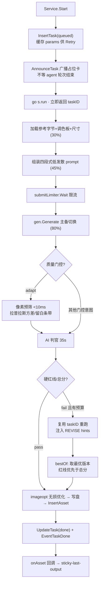

#### 质量门控机制

触发范围 `isQualityGatedKind`：adapt_platform / change_character / change_background / change_text / add_character。仅 `Attempt==0` 首过进门控。

**两级检查**：
- **像素预筛**（仅 adapt，纯 Go <10ms）：拉普拉斯方差判模糊 + 纯色边框判留白条带，失败直接跳过 AI 判官省 5-15s。
- **AI 判官**（`vision/quality.go`，35s 超时）。

**非融合维度**（6+1）：`compliance`（红线）、`subject_consistency`、`character_appeal`、`overall_quality`、`canvas_fill`、`key_elements_fidelity`（红线）、`ad_appeal`（仅参考不计红线）。

**硬红线判定**（`quality.go:416-466`，服务端评判，模型措辞从不直接当 verdict）：

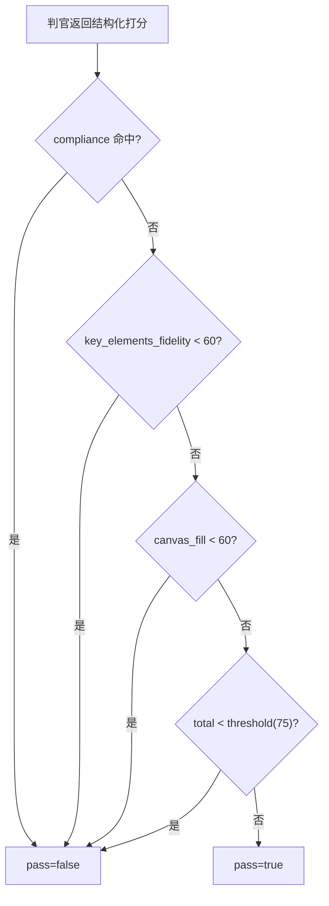

**bestOf 取最优**（red-line-aware，`preferFirst`）：① pass 者胜 ② 同 pass 比 `key_elements_fidelity`（直击"谁保住了文案/LOGO"，避免高 total 掩盖丢文案）③ 比 total ④ 全平取 regen。重试上限 `QualityMaxRetry=2`（最多 3 次生成）。**任何判官错误 degrade-to-pass，绝不卡流程**。

#### 角色融合：4 个专属质检维度

融合（`change_character`/`add_character`）请求级锁定 `gpt-image-2`（降级链 gpt-image-2 → gemini-3-pro-image → nil）。专属维度：

- `base_fidelity`（底图保真，硬红线 <60）：底图风格/文案/构图/配色未被参照图覆盖。
- `fusion_harmony`（自然融入度，软阈值 <60）：角色与底图光照/色温/边缘/透视协调，是重渲染而非贴图。
- `no_extra_subjects`（硬红线，bool）：不得凭空多生参考/底图之外的角色。
- `identity_fidelity`（身份保真，硬红线 <60）：被融合角色身份忠于参照图，且底图原主体未丢失。

**真相源契约**写死进 prompt（`fusionBaseClause`）：底图（图1）是画风/文案/意图/构图/背景/配色的**唯一真相源**，参考图仅供角色身份。

> 关键 HTTP 细节：多图全走同一 repeated `image[]` 字段、base 在首（`http_provider.go:144-159`）。曾把 base 当 scalar `image`、参考当 `image[]`，被网关丢弃致模型只见 base 而幻想出参考角色——这是融合 bug 的根因。

#### 主备切换与注入防护

- `FailoverGenerator`：Primary 失败才试 Backup，`Output.Provider` 记录实际产出方。
- **prompt 注入防护**（design D5）：用户自由文本**永不直接成 prompt**。`Sanitize` 用 7 条正则剥离 "ignore previous instructions"/"system:"/"you are now" 等，去控制字符，**按 rune 截断**到 500（CJK 同等预算，绝不把汉字截成 `U+FFFD`）。四段式骨架中 CONTEXT/PRESERVE/AVOID 是固定文本绝不接受用户输入，仅 MODIFY 携带 sanitized slot。用户圈区二次调整的 `RegionDesc` 同样 Sanitize 并 scope 到所选区域。

---

### 4.3 平台适配

适配不是纯裁剪，而是"AI 理解原图 → 按目标比例重绘补全"。但比例匹配时应避免无谓重绘（增延迟+形变风险）。

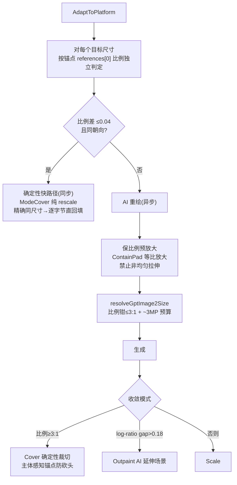

修复的两个美感杀手：
- **形变压扁**（`fix-adapt-aspect`）：曾用 `ModeScale` 非均匀拉伸把 16:9 源图压成 2.5:1 画布，模型在看到前就被压扁。改为 `ContainPad` 等比放大、留透明边距供模型延伸。
- **同尺寸仍重新生成**：多参考组曾强制每个尺寸 AI 重绘，对与锚点同比例/同尺寸的目标做了 166s 无谓生成。改为比例匹配走确定性快路径，精确同尺寸逐字节直回填（像素完美、零等待）。

极端比例（如 6:1）因 gpt-image-2 钳到 3:1，prompt 显式注入 safe-band 提示："只有中央 N% 带存活，主体/LOGO/文案全塞中央带"，且 `extremeConvergeRatio == gptImage2MaxRatio == 3.0` 三处同一常量保证 prompt 侧与收敛侧一致。

---

### 4.4 视觉分析与图层精修

#### 宣发视觉分析 + 内容寻址缓存

固定 prompt 产出 4 行结构化报告（核心主题/IP/游戏名、主体、宣发意图、必须保留），直接用作生图 prompt 的 THEME 槽约束。两套传输：OpenAI 兼容（需公网 URL，走 COS）与 **Gemini 原生 inline**（图片 base64 内联，不依赖 COS）。

**CacheKey 单一真相源**（`vision/cachekey.go`）：单图 → 裸 md5（对齐上传预热）；多图组 → `md5("group:"+有序拼接)`。adapt 主流程、图章只读分析端点共用同一函数 → **双向共享缓存**：上传预热写过的报告 adapt 直接命中，图章模式算过的组合 adapt 也命中。

#### 图层精修：从"AI 重绘"到"确定性掩码抠图"

这是项目最能体现垂类工程判断的决策。曾用两次 AI 重绘做分层（N 个 `extract_layer` 让模型把主体重画在绿幕上键绿 + 1 个 `fill_background` inpaint），与用户真实诉求存在三处根本矛盾：

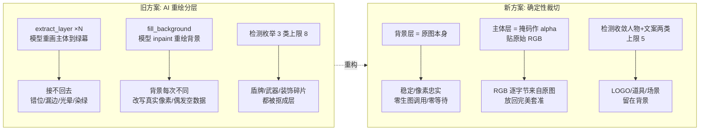

**根因结论**：分层目的是**人工微调**，需要的是忠实于原图的可移动块，而非 AI 重新创作。新方案 `Service.Split`（同步 detect→cut→persist，零生成任务等待）：

1. 检测前景主体（仅人物 + 宣发文案两类，上限 5）。Gemini 返回分割掩码（`box_2d/1000` + mask data URI）。
2. 背景层 = 原始源图本身（`Box={0,0,1,1}`，锁定底座）。
3. 每个主体层：按检测框裁切 → `applyMaskAlpha` 把 mask 双线性缩放后逐像素 `alpha = alpha × mask亮度/255`，**RGB 完全不动** → 透明底真抠图。
4. 掩码缺失/解码失败 → 降级为按框（+2% pad）裁不透明矩形子图（仍是原图像素，能接回去）。
5. 浏览器端 flatten 成 PNG，经 `composite` 端点（纯存储无 AI）落库。

> ⚠️ `wantMasks` 默认关闭：实测 yunwu 网关下 Gemini per-subject mask 要么超时挂起、要么回 literal `"..."` 占位符（网关不传 mask）。只对验证过会返回真 base64 的后端才 `SetWantMasks` 打开，防止"冻结分割"被静默重新引入。

---

### 4.5 实时传输层

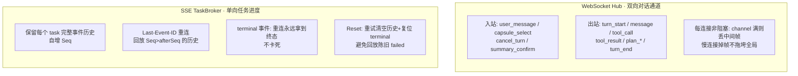

分工：WS 承载对话/工具/plan 生命周期事件；SSE 承载长任务进度。两者共用 `Event` 信封。

- plan 生命周期事件（`plan_created/step_started/step_done/step_failed/done`）走 **WS 对话通道**，是"上层进度视图"，与每步自身的 task_* SSE 事件并存。前端失败步骤标红、其后 pending 步骤变 skipped。
- SSE `Reset`（`sse.go:115-122`）：重试时清空历史 + 复位 terminal，Seq 从 1 重开——否则新订阅者会回放陈旧 task_failed 并永远卡在旧失败上。

---

### 4.6 会话、存储与配置

**匿名 session**：`Fingerprint{UserAgent,Language,Screen,Timezone,Nonce}` → `sha256` 取前 8 字节 hex，前缀 `sess_`。相同指纹→相同 id（支持重连）。非安全敏感（本工具无鉴权）。重连优先级：显式 sessionId（sessionStorage）→ 指纹派生 → 内存 → SQLite fallback（重启后恢复）。

**隔离在数据层强制**：`store.GetAsset(sessionID, id)` 等都按 `WHERE id=? AND session_id=?` 双条件，别的 session 的 asset id 直接 not-found。

**SQLite 表**（纯 Go `modernc.org/sqlite`，无 CGO，单静态二进制；`SetMaxOpenConns(1)` + WAL）：

| 表 | 要点 |
|---|---|
| sessions | id, fingerprint, created/last_seen |
| assets | kind(upload/generated/cropped/video/composite), provider, parent_id, meta(JSON), **gen_origin**(重试用，剥离凭证) |
| tasks | kind, status, progress, intent, error, asset_id |
| messages | 只存文本+ToolRefs，**绝不存原始图像/base64**，用于重启重建窗口 |
| preferences | (session,key) upsert |
| **cos_uploads** | md5→URL，**全局跨 session** 内容寻址去重 |
| **vision_reports** | md5→报告，`ToValidUTF8` 防孤立 rune 渲染成 "�" |

---

### 4.7 生视频

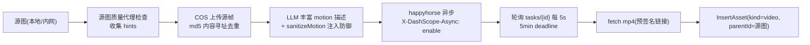

为何需要 COS：happyhorse 通过**公网 URL** 拉源图，而 studio 跑在内网。`Configured()` 要求 provider 和 uploader 都就绪，否则视频能力禁用、工具不进白名单。

---

### 4.8 前端

技术栈 Vite + React + TS + Tailwind + shadcn(Radix) + framer-motion，build 产物 `embed` 进 Go。

- **单状态源**：`useAppController`（1400+ 行）是唯一状态源，经 Context 下发，无 Redux/Zustand。
- **实时驱动 UI**：WS `onmessage` 大 switch 分发；打字机效果固定 16ms 节奏按 backlog 步进，与到达节奏解耦；每个 task 一个 `EventSource`，`STATUS_ORD` 保证状态**永不降级**（陈旧快照不能把 done 退回 running）。
- **关键交互**：图层精修画布（源图尺寸锁定、背景锁、主体可移动缩放、浏览器 flatten）、图章相册（多选≤16 参考图 + 全渠道尺寸插槽 + 三比例族覆盖提示）、执行计划卡、区域选择（point/rect/polygon）。
- **跨刷新持久化的 bug 修复**：`ADAPT_PANELS_KEY`（适配面板刷新重建）、`pendingConfirmRef`（React 18 批处理下 updater 内赋值读不到，曾卡 60s 安全超时）、`SELECTED_KEY`（引用选择持久化）。

---

## 5. 关键工程卡点与决策复盘

这些是从归档 change 与代码注释中提炼的真实卡点——它们是项目的"暗知识"，多数无法从代码结构直接看出。

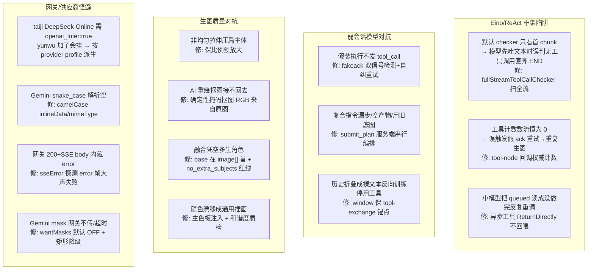

| 卡点 | 根因 | 决策 |
|---|---|---|
| 工具不执行直奔 END | Eino 默认 checker 只看流首 chunk | 自定义 `fullStreamToolCallChecker` 扫全流 |
| 重复生图 + 假执行误判 | 数 stream chunk.ToolCalls 恒为 0 | 从 tool-node 回调统计真实执行数 |
| 同请求发两次 | 去重签名含 `await_result` 投递提示字段 | 签名剔除 `await_result` 等非语义字段 |
| 弱模型假装执行 | 文字 ack 不发 tool_call | fakeack 双信号检测 + turn_reset + 自纠重试 |
| 复合指令翻车 | 依赖模型自觉 await/串联 | submit_plan 服务端确定性串行 + 占位符依赖联动 |
| 主体被压扁 | adapt 预放大用非均匀拉伸 | 保比例 ContainPad，禁止 ModeScale |
| 抠图接不回去 | AI 重绘改像素 | 确定性掩码抠图，背景=原图、主体 RGB 逐字节来自原图 |
| 融合凭空多生角色 | base 当 scalar 被网关丢弃 | base 与参考同走 `image[]`、base 在首 + 4 维融合质检 |
| CJK 报告被截断丢尾行 | max_tokens=200 + byte 边界截断 | 提到 800 + rune 边界截断 |
| chat 凭证被污染 | 所有 provider fallback 到 common 网关 | per-provider 凭证解析，standalone 不 fallback |

---

## 6. 优雅降级矩阵

无凭证时能力自动降级而非崩溃，这是"小团队内部工具、按需配置"的工程体现：

| 能力 | 未配置时行为 |
|---|---|
| 对话模型（ANTHROPIC_API_KEY） | 对话不可用，其余（上传/裁剪/下载）正常 |
| 生图（IMAGE_PRIMARY） | 生图工具不进白名单，Agent 礼貌告知 |
| 视觉分析（vision） | describe-region/vision-report 端点 503，前端隐藏分析块、退纯文本编辑 |
| 质量判官 | 全部 degrade-to-pass，直出不卡流程 |
| COS | 视频禁用、抠图按 inline 降级 |
| Gemini 透明底 | extract_layer 降级默认适配器（绿幕键出），adapt "透明底" 改写为"纯净中性单色背景" |
| outpainter | 极端比例回退 band padding |
| CJK 字体 | 中文叠加**明确报错**而非出豆腐块，ASCII 不受影响 |

---

## 7. 技术栈与约束

**后端**：Go 1.25，CloudWeGo Eino（ReAct/工具/流式/interrupt-resume），`coder/websocket`，`modernc.org/sqlite`（无 CGO），`golang.org/x/image`，`tencentyun/cos-go-sdk-v5`，`rs/zerolog`。单二进制 + `embed` 前端。

**前端**：Vite + React + TS + Tailwind + shadcn + framer-motion，build 产物嵌入二进制。

**模型**（服务端硬编码，用户不可选）：对话 `claude-opus-4-8`（主）/ DeepSeek（测试）；生图 `gpt-image-2` 主+备；视觉 Gemini / 豆包 vision；视频 happyhorse。

**约束**：
- 仅供小团队内部使用，**无鉴权**，密钥经环境变量注入（不硬编码）。
- 用户无需注册，进入即按浏览器指纹生成 session。
- 仅执行预设几类意图，其余礼貌拒绝。
- 用户可点图二次调整，注入到生图 prompt 的内容做 Sanitize 防护。

---

> 本文档对齐截至 commit `6d56200` 的代码实现。各能力的行为验收基准见 `openspec/specs/<capability>/spec.md`，历史决策见 `openspec/changes/archive/`。
